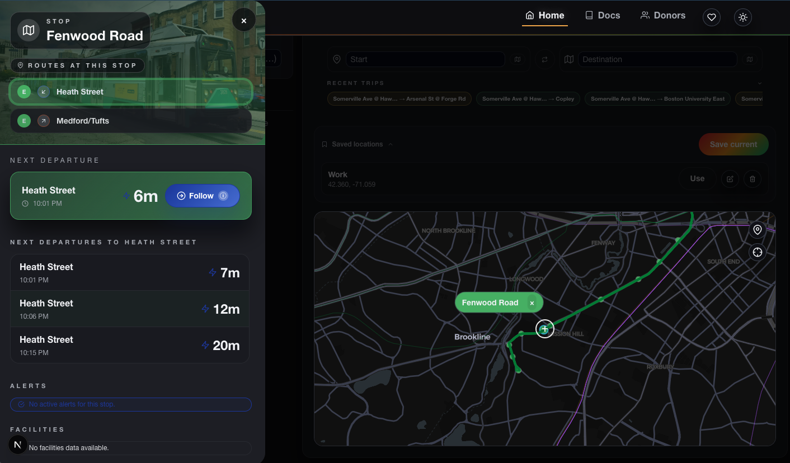
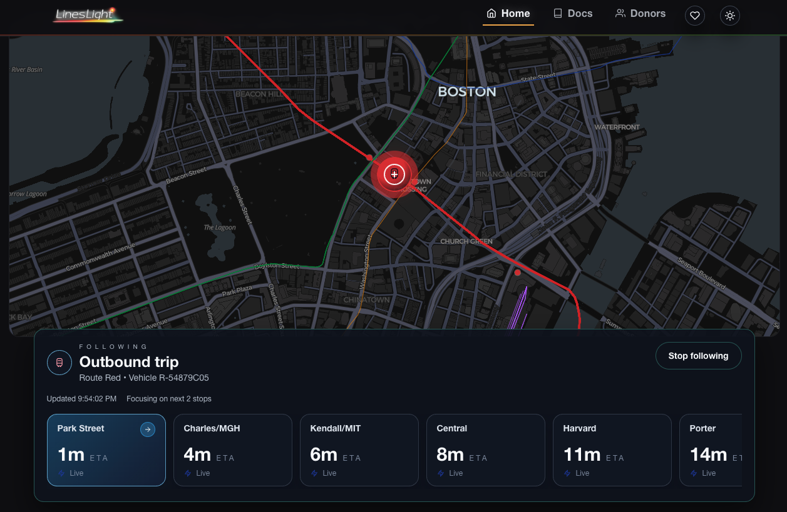
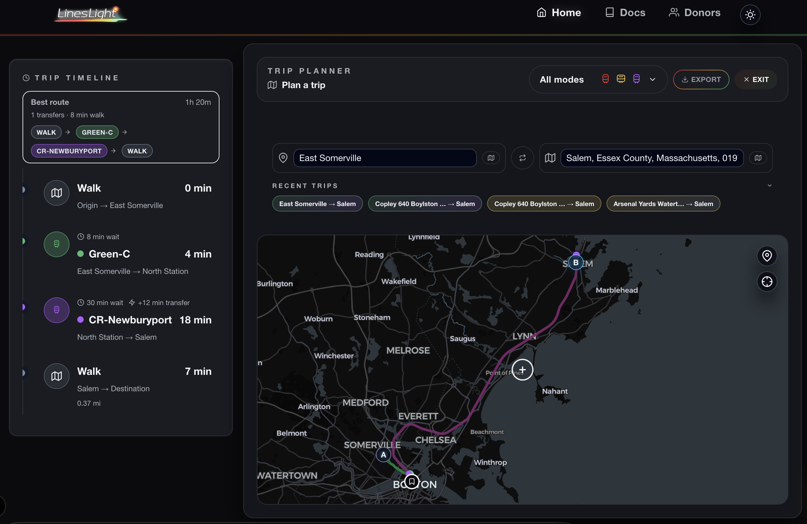
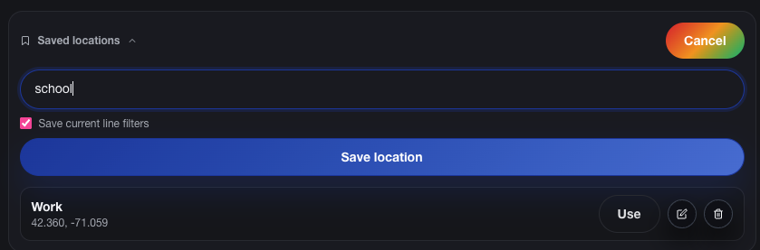

# LineLight

[](https://github.com/edemarest/linelight/actions/workflows/ci.yml)
[](LICENSE)

LineLight is a map-first MBTA system radar that blends static MBTA data with realtime feeds to show line health, station boards, and system insights at a glance.



## Highlights

- Map-centric UI with line health, vehicle motion, and station boards.
- Backend polling layer that aggregates MBTA data and provides app-specific endpoints.
- Shared TypeScript models via `@linelight/core`.
- Local-first workflows with Docker and npm workspaces.

## Repository layout

```text
.
├─ backend/          # API server, polling, caching, services
├─ web/              # Next.js frontend
├─ packages/core/    # Shared types + API helpers
└─ docs/             # Product, architecture, and implementation docs
```

## Quickstart (local dev)

```bash
# install dependencies (root workspace)
npm install

# backend env
cp backend/.env.example backend/.env

# web env
cp web/.env.example web/.env.local

# run in two terminals
npm run dev:backend
npm run dev:web
```

Backend: `http://localhost:4000`  
Frontend: `http://localhost:3000`

## Screenshots

| Stop sheet | Follow mode |
| --- | --- |
|  |  |

| Trip planning | Saved locations |
| --- | --- |
|  |  |

## Docs

Start here: `docs/README.md`

## Common scripts

```bash
# workspace builds
npm run build

# backend tests
npm --workspace backend run test
```

## Docker (optional)

```bash
docker compose up --build
```

For more details, see `docs/development/docker-commands.md`.
## Data files

Large MBTA-derived data exports live in `data/`. See `data/README.md` for provenance and update notes.

## License

Apache-2.0. See `LICENSE`.
